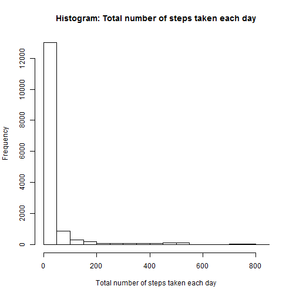
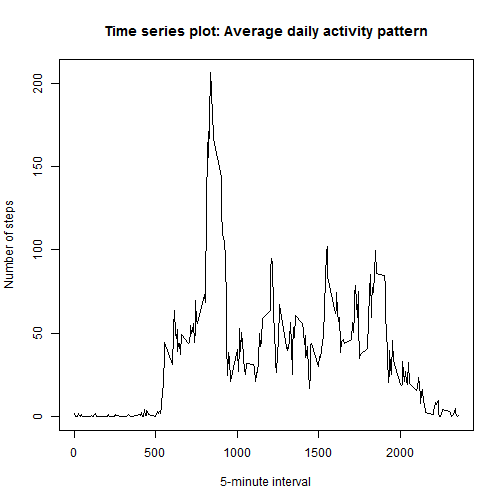
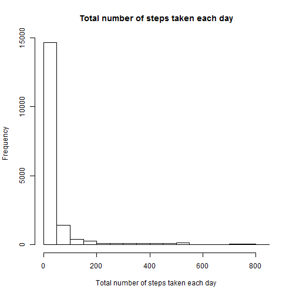
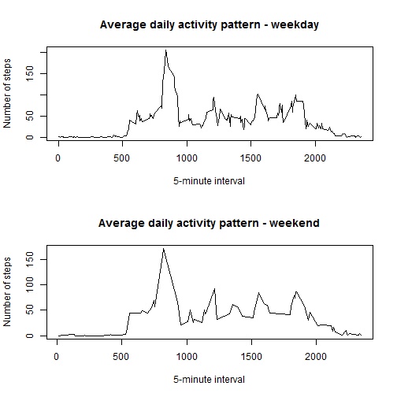

# Reproducible Research: Peer Assessment 1


## Loading and preprocessing the data

```r
df0.raw <- read.csv("./activity/activity.csv")
```

steps: Number of steps taking in a 5-minute interval  
date: The date on which the measurement was taken in YYYY-MM-DD format  
interval: Identifier for the 5-minute interval in which measurement was taken  

#### Take a look at the raw data

```r
str(df0.raw)
```

```
## 'data.frame':	17568 obs. of  3 variables:
##  $ steps   : int  NA NA NA NA NA NA NA NA NA NA ...
##  $ date    : Factor w/ 61 levels "2012-10-01","2012-10-02",..: 1 1 1 1 1 1 1 1 1 1 ...
##  $ interval: int  0 5 10 15 20 25 30 35 40 45 ...
```

```r
head(df0.raw)
```

```
##   steps       date interval
## 1    NA 2012-10-01        0
## 2    NA 2012-10-01        5
## 3    NA 2012-10-01       10
## 4    NA 2012-10-01       15
## 5    NA 2012-10-01       20
## 6    NA 2012-10-01       25
```

```r
tail(df0.raw)
```

```
##       steps       date interval
## 17563    NA 2012-11-30     2330
## 17564    NA 2012-11-30     2335
## 17565    NA 2012-11-30     2340
## 17566    NA 2012-11-30     2345
## 17567    NA 2012-11-30     2350
## 17568    NA 2012-11-30     2355
```

```r
summary(df0.raw)
```

```
##      steps               date          interval   
##  Min.   :  0.0   2012-10-01:  288   Min.   :   0  
##  1st Qu.:  0.0   2012-10-02:  288   1st Qu.: 589  
##  Median :  0.0   2012-10-03:  288   Median :1178  
##  Mean   : 37.4   2012-10-04:  288   Mean   :1178  
##  3rd Qu.: 12.0   2012-10-05:  288   3rd Qu.:1766  
##  Max.   :806.0   2012-10-06:  288   Max.   :2355  
##  NA's   :2304    (Other)   :15840
```
#----------------------------------------------------------------------


## What is mean total number of steps taken per day?

#### For this part of the assignment, you can ignore the missing values in the dataset.

#### Make a histogram of the total number of steps taken each day

```r
hist(df0.raw$steps, 
     xlab = "Total number of steps taken each day",
     main = "Histogram: Total number of steps taken each day")
```

 

```r
#?hist
```

#### Calculate and report the mean and median total number of steps taken per day

```r
mean.steps <- mean(df0.raw$steps, na.rm = TRUE)
median.steps <- median(df0.raw$steps, na.rm = TRUE)

print(mean.steps)
```

```
## [1] 37.38
```

```r
print(median.steps)
```

```
## [1] 0
```


## What is the average daily activity pattern?

#### Make a time series plot (i.e. type = "l") of the 5-minute interval (x-axis) and the average number of steps taken, averaged across all days (y-axis)


```r
# Create a new dataset, containing complete cases only
df1.na.omit <- na.omit(df0.raw)

# Aggregate the number of steps (average accross all the days) by 5-minute interval
df2.steps.interval <- aggregate(x = df1.na.omit[ , "steps"], by = list(x = df1.na.omit$interval), 
                                FUN = mean, na.rm = TRUE)

# Update the names of the new dataframe
names(df2.steps.interval) <- c("interval", "mean.steps")
```


```r
# Plot the 5-minute interval (x-axis)
with(df2.steps.interval, plot(x = interval, y = mean.steps, 
     type = "l",
     xlab = "5-minute interval",
     ylab = "Number of steps",
     main = "Time series plot: Average daily activity pattern"))
```

 


#### Which 5-minute interval, on average across all the days in the dataset, contains the maximum number of steps?


```r
# Identify the 5-minute interval containing the maximum number of steps
df2.steps.interval[which.max(df2.steps.interval[ , 2]), ]
```

```
##     interval mean.steps
## 104      835      206.2
```


## Imputing missing values

#### Note that there are a number of days/intervals where there are missing values (coded as NA). The presence of missing days may introduce bias into some calculations or summaries of the data.

#### Calculate and report the total number of missing values in the dataset (i.e. the total number of rows with NAs)


```r
# Calculate the total number of rows with NA
nrow(df0.raw[!complete.cases(df0.raw), ])
```

```
## [1] 2304
```

#### Devise a strategy for filling in all of the missing values in the dataset. The strategy does not need to be sophisticated. For example, you could use the mean/median for that day, or the mean for that 5-minute interval, etc.

The strategy I am using for filling in all of the missing values in the dataset is to replace the missing values with the average number of steps for that 5-minute interval, averaged accross all days (with non-missing values).

#### Create a new dataset that is equal to the original dataset but with the missing data filled in.


```r
# Create a new dataset, raw merged with the average number of steps for each 5-minute interval
df3.replace <- merge(df0.raw, df2.steps.interval, by = intersect(names(df0.raw), names(df2.steps.interval)))

# Create a new variable that is a copy of steps
df3.replace <- within(df3.replace, steps.replace <- df3.replace$steps)

df3.replace$steps.replace <- ifelse(is.na(df3.replace$steps), df3.replace$mean.steps, 
                                    df3.replace$steps.replace)
```

#### Make a histogram of the total number of steps taken each day and Calculate and report the mean and median total number of steps taken per day. Do these values differ from the estimates from the first part of the assignment? What is the impact of imputing missing data on the estimates of the total daily number of steps?


```r
hist(df3.replace$steps.replace, 
     xlab = "Total number of steps taken each day",
     main = "Histogram: Total number of steps taken each day (Imputed Missing Values)")
```

 

```r
#?hist
```

# The histogram is very similar, with a higher frequency, for each day


```r
mean.steps.replace <- mean(df3.replace$steps.replace, na.rm = TRUE)
median.steps.replace <- median(df3.replace$steps.replace, na.rm = TRUE)
print(mean.steps.replace)
```

```
## [1] 37.38
```

```r
print(median.steps.replace)
```

```
## [1] 0
```

# I get the same answer!

```r
mean.steps.replace == mean.steps
```

```
## [1] TRUE
```

```r
median.steps.replace == median.steps
```

```
## [1] TRUE
```


## Are there differences in activity patterns between weekdays and weekends?

#### For this part the weekdays() function may be of some help here. Use the dataset with the filled-in missing values for this part.

#### Create a new factor variable in the dataset with two levels ? ?weekday? and ?weekend? indicating whether a given date is a weekday or weekend day.


```r
# Create a new date variable using POSIXt format
df3.replace$date.Ymd <- strptime(df3.replace$date, format = "%Y-%m-%d")

# Create a new chr variable containing the weekday
df3.replace$day <- weekdays(df3.replace$date.Ymd)
#?weekdays  # Extract Parts of a POSIXt or Date Object

# Create a new factor variable containing the type of day
df3.replace$day.type <- as.factor(ifelse(df3.replace$day %in% c("Saturday", "Sunday"), "weekend", "weekday"))
```

#### Make a panel plot containing a time series plot (i.e. type = "l") of the 5-minute interval (x-axis) and the average number of steps taken, averaged across all weekday days or weekend days (y-axis). The plot should look something like the following, which was creating using simulated data:


```r
par(mfrow = c(2, 1))
?layout
```

```
## starting httpd help server ... done
```

```r
with(df2.steps.interval[df3.replace$day.type == "weekday", ], plot(x = interval, y = mean.steps, 
     type = "l",
     xlab = "5-minute interval",
     ylab = "Number of steps",
     main = "Panel Plot Part A: Average daily activity pattern - Weekday"),
     )

with(df2.steps.interval[df3.replace$day.type == "weekend", ], plot(x = interval, y = mean.steps, 
     type = "l",
     xlab = "5-minute interval",
     ylab = "Number of steps",
     main = "Panel Plot Part B: Average daily activity pattern - Weekend"))
```

 
